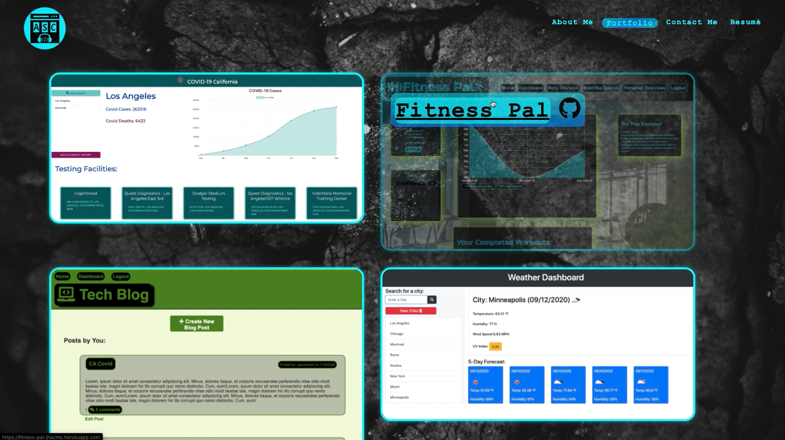

# react-portfolio

## Description

This weeks challenge was to rebuild our portfolio using React.JS. React is a popular Single-Page Application, or SPA, language that a lot of big companies like to use. Apps are popularly built in React because of their effciency when loading. Users will see quick load times beteen pages and also functional responsiveness across media devices. In my personal portfolio users can navigate between four pages, the "About", "Portfolio", "Contact" and "Resumé" pages. All of these pages load quickly and effciently thanks to React. 

## Table of Contents

* [Installation](#installation)
* [Usage](#usage)
* [License](#license)
* [Contributing](#contributing)
* [Links](#links)
* [Questions](#questions)

## Installation 

Run 'npm install' in the command line to install all the necessary dependencies if trying to run the app locally.

## Usage

To access this application simply navigate to https://aaroncenteno.github.io/react-portfolio/  and begin browsing my projects. 

## Licenses

* MIT

## Contributing

* Aaron Centeno

## Technologies Used
* Node Modules
* GitHub
* JavaScript
* React.js
* Terminal
* CSS
* Font Awesome Library

## Screenshots

## Links

Live App: https://aaroncenteno.github.io/react-portfolio/

GitHub Repo: https://github.com/aaroncenteno/react-portfolio

## Questions

Contact Information for questions: 

GitHub: [aaroncenteno](https://www.github.com/aaroncenteno) 

E-mail: asamcent@gmail.com